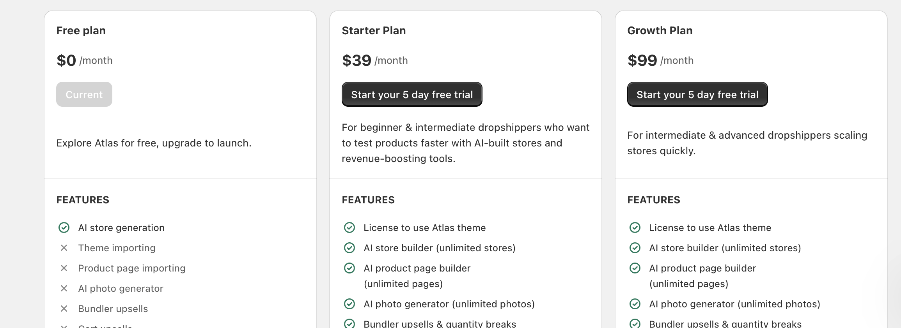

# Taskly: AI Chat for Stores - PRD

This is a Shopify app that uses AI to help you manage your store data. It provides a chat interface for interacting with your store, and a subscription management system for managing your subscriptions.

## Features

### Chat

#### UI / UX

- Basic chat interface with AI-powered assistance
- Input autofocus so when user came to the page it been focused
- Chat messages sorted by timestamp so most recent at the bottom
- chat scrolls to bottom when new message is added and when user comes to the page
- once user send a message, it's added to the chat history with a timestamp and a role user.
- once user click send message the arrow button is replaced by a pause icon button

#### Backend / AI

- once user send a message, it's sent to the api that executes sequence of operations to generate a response

1. save the message to the database with a timestamp and a role user
2. (AI) Identify the intent of the user message is it a query, command, or a message and label it: query, mutation, or message

##### QUERY: the user message is a query

1. find query names and descriptions from shopify graphql api: like that

```graphql
{
  __schema {
    queryType {
      fields {
        name
        description
      }
    }
  }
}
```

2. (AI) Identify most relevant queries by passing the user message to the AI model along side with the queries result and get the most relevant queries by
   name like: getProducts, getOrders, getCustomers, getCollections.
3. (AI) Generate a proper graphql query based on the user message and the most relevant queries
4. Execute the generated graphql query and get the response
5. (AI) Prepare ai response based on the response and the user message example: You have **3 products** in your store. Most items have good inventory levels, with **2 active products** and **1 draft** that needs attention.

##### MUTATION: the user message is a mutation

1. find mutation names and descriptions from shopify graphql api: like that

```graphql
{
  __schema {
    mutationType {
      fields {
        name
        description
      }
    }
  }
}
2. (AI) Identify the most relevant mutations by passing the user message to the AI model along side with the mutations result and get the most relevant mutations by
name like: createProduct, updateProduct, deleteProduct, createOrder, updateOrder, deleteOrder, createCustomer, updateCustomer, deleteCustomer, createCollection, updateCollection, deleteCollection.
3. (AI) Generate a proper graphql mutation based on the user message and the most relevant mutations
4. Execute the generated graphql mutation and get the response
5. (AI) Prepare ai response based on the response and the user message example: **10 products** updated successfully.

##### MESSAGE: the user message is a message
1. generate simple answer based on the user message example: I can help you with your store operations. Try asking me specific questions about your products, orders, customers, or other store data!

### Subscription

- label: Subscription
- title: Plans, descriptions, Choose the best plan for you. Upgrade as you grow.
- 3 Cards: Free, Pro, Enterprise
- Button "Current" and disabled if plan is active
- Button "Start your 5 days free trial" and enabled if plan is inactive
  
- Plans: Free, Pro, Enterprise
- Features: 20 AI queries per month, Basic chat support, Store data insights, Email support
- Limitations: Limited AI queries, Basic features only
- Button: Downgrade
- Button: Start your 5 day free trial
```
